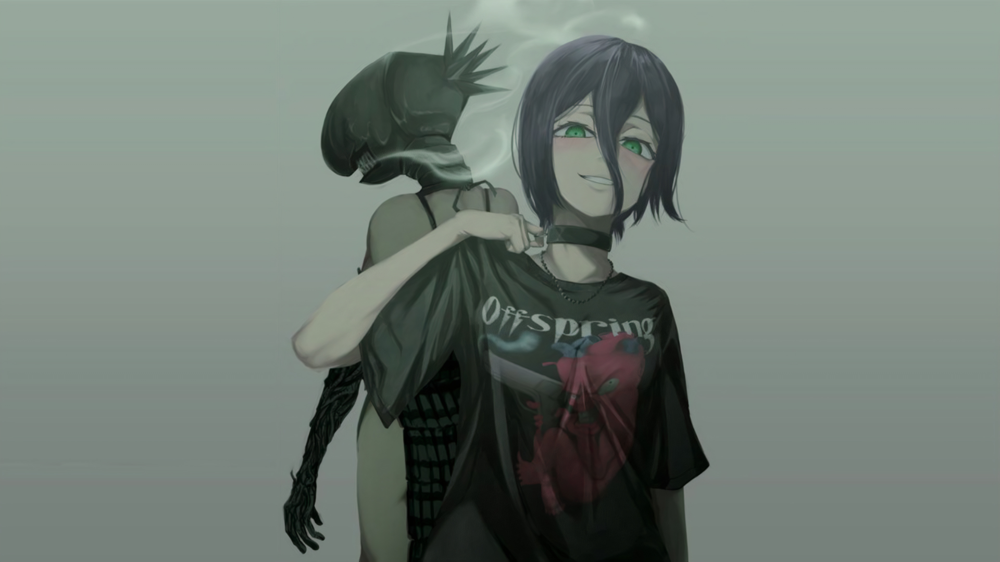

## :clap:Hi,there.I'm lavard~:blush:
**Hi, I'm lavard, a font-end and full-stack engineer from China. 
哈喽，这里是来自拉夫德鲁的码农的gayhub主页，一名前端兼全栈工程师，目前在学习~~nuxt.js~~ Java 和~~nest.js~~ Rust**

---

### 🛠Tech Stack

<code>

</code>

### 👋My Situation
- 🔭 I’m currently working on [Vue](https://vuejs.org/) and [React](https://beta.reactjs.org/) development;
- 🌱 I’m currently learning [Java](https://github.com/topics/java) , [Node.js](https://github.com/topics/nodejs) and [Rust](https://github.com/golang/go);
- 💬 Ask me about anything tech related, I am happy to help;
- ⚡ Fun fact: I like rebasing and `--force` pushing my commits😊

### 🙏My Life

