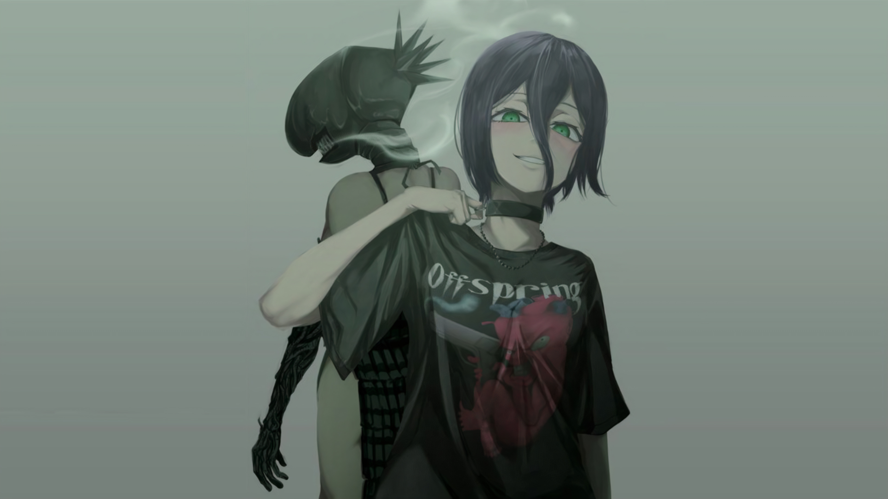
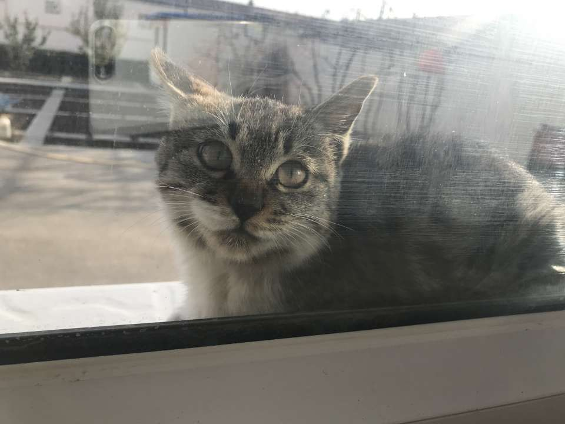

## :clap:Welcome to Lavard's Org
**Hi, there. I'm lavard, a font-end and full-stack engineer from China Guangzhou. I am currently studying ~~nuxt.js~~ Java 和~~nest.js~~ Rust**  

---
**You see this avatar, you know it is me(joke🤣).**

---

### 🛠 Tech Stack

<code>

</code>

### 👨‍💻‍ My Situation
- 🔭 I’m currently working on [Vue](https://vuejs.org/) and [React](https://beta.reactjs.org/) development;
- 🌱 I’m currently learning [Java](https://github.com/topics/java) , [Node.js](https://github.com/topics/nodejs) and [Rust](https://github.com/golang/go);
- 💬 Ask me about anything tech related, I am happy to help;
- ⚡ Fun fact: I like rebasing and `--force` pushing my commits😊

### 🙏 My Life

